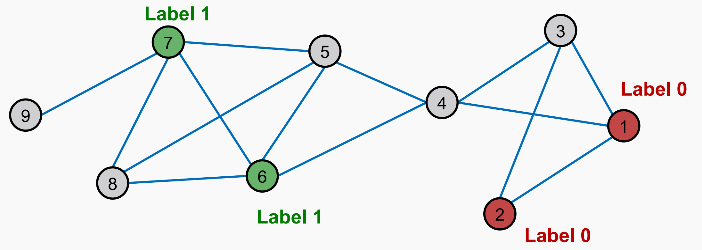
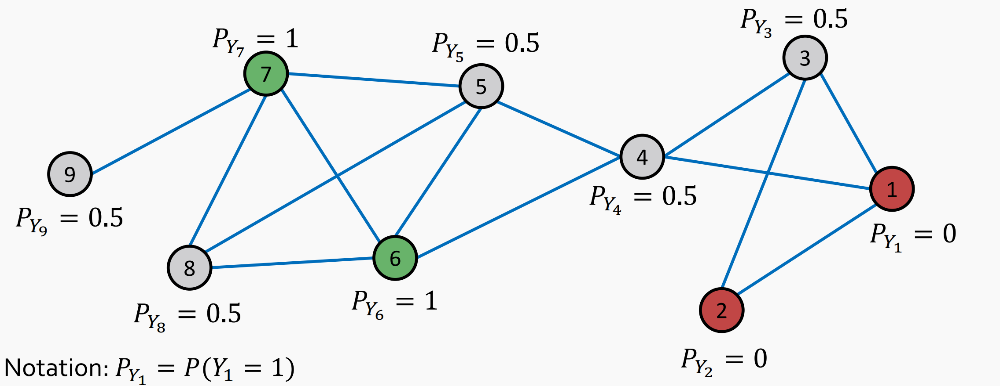
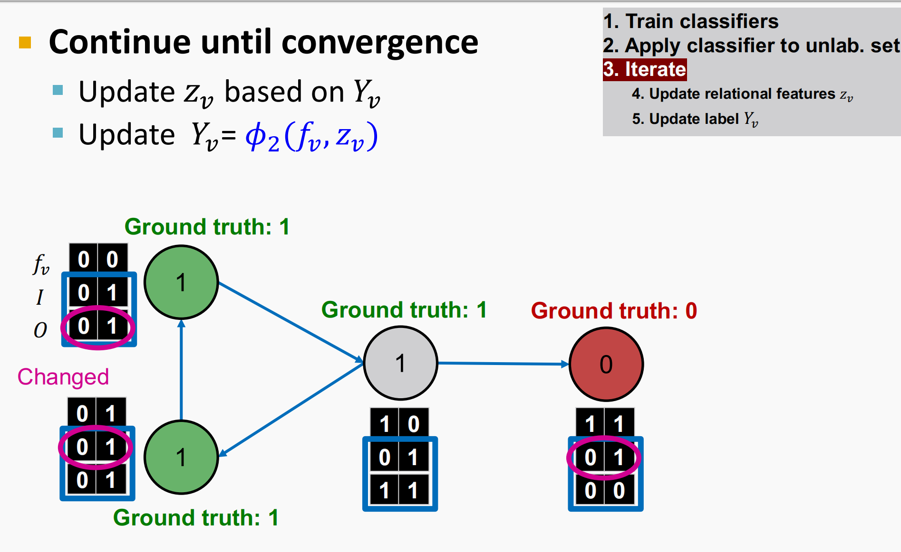
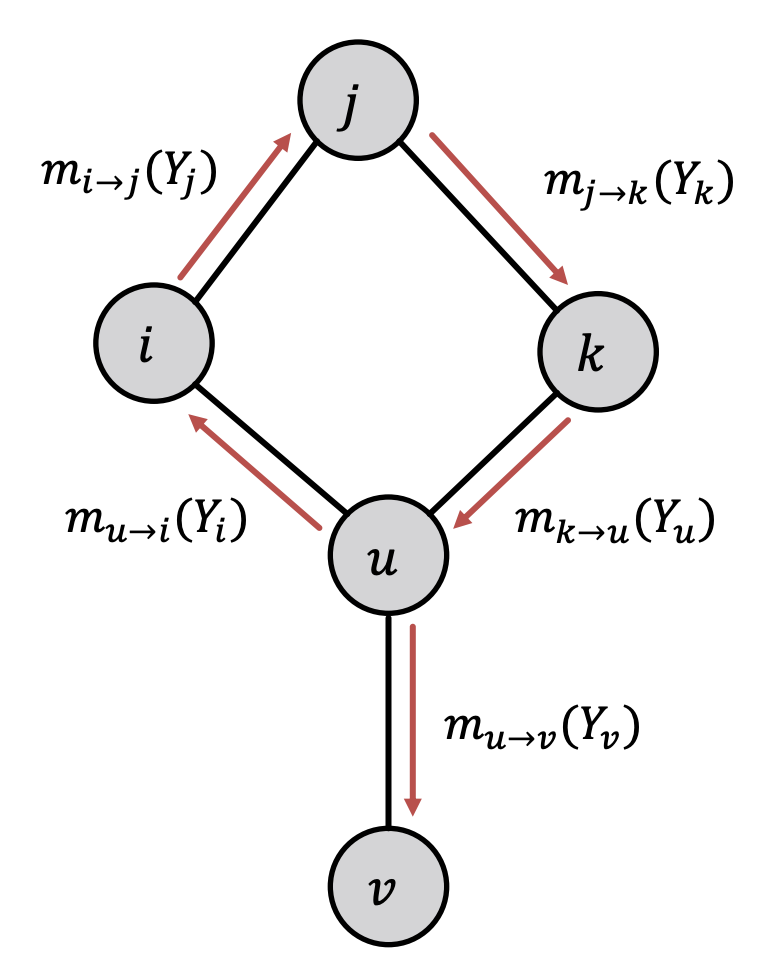

# Chapter3 消息传递和节点分类

- **斯坦福大学公开课CS224W的学习笔记**
- **Learner** : shenhao
- **Lecture 5**

## 3.0 消息传递和节点分类

这一节内容主要关注：对于一个给定的网络结构，网络中的部分节点已经做好了标注，那么我们如何对图中的其他节点进行标注呢？

- 举例：已知网络中有一些诈骗网页，还有一些可信网页，那么如何根据网页间的超链接，进一步找到其他诈骗或者可信的网页节点？

- 对于训练数据中一部分有标签，剩下的没标签，这类任务被称为半监督的节点分类问题。

  > 这样的半监督学习经常被用在：
  >
  > - 文本分类
  > - 语音标记
  > - 连接预测
  > - 光学字符识别
  > - 图像和3D分割
  > - 节点异常检测

之前已经介绍了**节点嵌入**的方法可以识别相似的节点以及处理节点分类问题，而这一节主要介绍的方法是**消息传递**机制。

### 3.0.1 概述

一般我们认为网络中的关系是具有相关性的，也就是说相似的节点会互相连接，并且相近的节点可能属于相同的类型。即同质性和影响力决定了节点间会存在关联。

- **同质性**：人以类聚，物以群分 | 相同或者类似的节点会和其他的节点相互连接。

  - 举例：一个在线社交网络，以人为节点，朋友关系为边，通过人们的兴趣将节点分为多类。
    从图中可以看出，各种颜色都分别聚在一起，亦即有相同兴趣的人们更有聚集在一起的倾向。

  

  

- **影响力**：近朱者赤，近墨者黑 | 给定节点对自身标签的信念会收到周围节点标签的影响。

类似于 PageRank 中将节点的 vote 通过链接传递到下一节点，但是在这里我们更新的**不再是重要性的分数**，而是对**节点标签预测的概率**。

本章内容将主要介绍三种半监督图学习的技术：

- 关系分类 Relational classification
- 可迭代分类 Iterative classification
- 信任传播 Belief propagation

首先我们先思考一下解决分类问题思路是什么？

### 3.0.2 半监督学习

**给定**：具体的图，一些带标签的节点

**目标**：对其余没有标签的节点进行分类

**主要假设**：该网络具有**同质性**（相似节点会在网络中更加靠近，或者直接相连）

**任务**：

- $A$： n×n 的邻接矩阵
- $Y=\{0,1\}^n$是标签向量
  - $Y_v=1$ 属于第一类
  - $Y_v=0$ 属于第二类
  - 一些没有标签的节点

#### 3.0.2.1 基本的逻辑

我们已知**相似节点会在网络中更加靠近，或者直接相连**。

因此根据关联推定：如果我与具有标签 $X$ 的节点相连，那么我也很可能具有标签 $X$ 。

而对于图而言，预测一个节点 $v$ 的标签，我们需要：

-  $v$ 的特征
-  $v$ 邻居的标签
-  $v$ 邻居的特征

## 3.1 关系分类

关系分类的基本想法：

- 节点 $v$ 的类概率 $Y_v$ 是一个节点附近节点的类别概率的**加权平均**(这里我们只考虑二分类问题)
- 对于已经有标记的节点 $v$ ，其 $Y_v$ 可以**直接设置成其真实类别**
- 对于没有标记的节点可以将其初始化为 $Y_v=0.5$ 
- 然后以随机的顺序，对所有的节点进行类似于加权平均的更新，直到收敛或者达到最大迭代次数上限。

更新的公式：
$$
P(Y_v=c)=\frac{1}{\sum_{(v,u)\in E}A_{v,u}}\sum_{(v,u)\in E}A_{v,u}P(Y_v=c)
$$

- 邻接矩阵 $A_{v,u}$ 表示边的权重
- 分母是节点 $v$ 的度数或入度
- $P(Y_v=c)$ 是节点 $v$ 标签为 $c$ 的概率

问题在于：收敛是没有保证的，并且模型没有用到节点的特征信息

### 3.1.1 举例

在第四次迭代后，所有的分数都收敛稳定了。我们可以预测出：

- 节点4，5，8，9属于类别1
- 节点3属于类别2

## 3.2 迭代分类

相比于关系分类（没有用到节点的属性），迭代分类会使用节点 $v$ 的一系列特征构成的特征向量 $f_v$ 和邻近节点的标签 $z_v$ 。

**输入**：图

-  $f_v$ ：节点 $v$ 的一系列特征构成的特征向量
- $Y_v$ ：节点 $v$ 的标签

**任务**：预测没有标签节点的标签。

**两个分类器**：

- $\phi_1(f_v)$ ：通过节点的特征来预测节点的标签 | **基础分类器**（base classifier）。

- $\phi_2(f_v,z_v)$ ：通过特征向量和邻近节点的标签的汇总来共同预测节点的标签 | **关系分类器**（relational classifier）

训练两个分类器只是第一阶段，第二阶段需要进行迭代训练直到结果收敛或者训练结束，但是结果是否收敛依然没有保证。

### 3.2.1 如何计算 $z_v$

 $z_v$ 是捕捉节点 $v$ 周围节点标签的向量，有以下几种表示：

-  $N_v$ 中每个标签的数量（或分数）的直方图
-  $N_v$ 中最常出现的标签
-  $N_v$ 中不同标签的个数

### 3.2.2 迭代分类器的结构

1. 第一步：基于节点特征建立分类器

  - 在训练集上训练如下分类器 (可以用线性分类器、神经网络等算法)：

  - $\phi_{1}\left(f_{v}\right)$ 基于 $f_{v}$ 预测 $Y_{v}$
  - $\phi_{2}\left(f_{v}, z_{v}\right)$ 基于 $f_{v}$ 和 $z_{v}$ （ $v$ 邻居标签的summary）预测 $Y_{v}$

2. 第二步：迭代至收敛

  - 在测试集上，用 $\phi_{1}$ 预测标签，根据 $\phi_{1}$ 计算出的标签计算 $z_{v}$ 并用 $\phi_{2}$ 预测标签

  - 对每个节点**重复迭代**计算 $z_{v}$ 、用 $\phi_{2}$ 预测标签这个过程直至收敛或到达最大迭代次数 $(10,50,100,\dots)$

> 注意：模型不一定能收敛

### 3.2.3 举例：网页分类

**节点**是网页，**链接**是超链接，**链接有向**（通过超链接指向另一个页面），**节点特征**简化设置为2维二元向量。

**任务**：预测网页主题

- 首先训练一个基于二维特征向量的分类器，用邻近节点（区分出和入节点）的特征向量作为$z_v$
- 然后按照步骤训练出两个分类器，然后用测试集来测试分类器的效果，并对关系特征$z_v$和标签进行更新
- 进行迭代更新，直到收敛或者达到次数上限

**具体流程**

1. 训练一个基于节点特征训练分类器（$\phi_1$）

​		可以假设分类器以特征第一个元素作为分类标准，于是对中间节点分类错误。

2. 根据 $\phi_{1}$ 得到的结果，计算 $z_{v}$ 

   此处设置 $z_{v}$ 为[2,2]的张量

   -  $I$ ：入度的邻居标签信息向量，维度为2。
     - 第一维度表示标签为0的邻居节点的个数
     - 第二维度表示标签为1的邻居节点的个数
   - $O$​：出度的邻居标签信息向量，维度为2。
     - 第一维度表示标签为0的邻居节点的个数
     - 第二维度表示标签为1的邻居节点的个数
   -  $I_0 = 1$ 表示至少有一个指向该节点的邻居节点标签为1

   在这一步应用了网络结构信息。

   

3. 具体流程

   - 第一步：在训练集上训练 $\phi_1$ 和 $\phi_2$

     
   
   - 第二步：在测试集上用 $\phi_1$ 预测标签
   
     
   
   - 第三步：循环迭代——更新相关特征 $z_v$
   
     
   
   - 第四步：循环迭代——使用 $\phi_2$ 更新标签 $Y_v$
   
     
   
   - 第五步：迭代直到收敛
   
     
   
   - 第六步：停止迭代
   
     

### 3.2.4 小结

关系分类

- 基于给定节点的邻居标签概率，迭代更新节点属于一个标签类的概率。

迭代分类

- 改进集合分类来处理属性/特征信息。
- 根据节点 $v$ 的特征以及邻居的标签对其进行分类

## 3.3 协作分类：信任传播机制

信任传播机制是一种动态规划算法，用于回答图中的概率问题（比如节点属于某类的概率）。通过节点和节点之间互相“通信”和传递消息的不断迭代，直到达到共识的时候，就可以计算出最后的结果，也就是置信度。

### 3.3.1 一个简单的消息传播的例子

举一个简单的例子来说明消息传递的作用，比如我们需要在一个图中计算节点总数，并且每个节点只能和与之相邻的节点之间进行通信，简单的消息传递算法的实现如下：

- 定义节点的顺序形成一条完整的路径
- 基于节点顺序生成边方向，从而决定message passing的顺序
- 按节点顺序，每次向下一个节点来传播当前统计到的节点个数，最后一个节点要发送出去的数据就是结果

这样的算法也可以在树状的结构中进行，区别就是要从**叶节点将信息汇总到根节点** 

### 3.3.2 循环消息传递算法

加入一个节点 $i$ 指向 $j$ ，那么 $i$ 将会给 $j$ 传递消息，而传递什么消息需要根据 $i$ 从指向 $i$ 的节点中获得的信息来决定，每个邻居给 $i$ 对其状态的置信度的信息。

循环消息传递算法中定义了这样几个关键的变量：
$$
\begin{aligned}
&\psi\left(Y_{i}, Y_{j}\right): \text { 节点 } i \text { 是节点 } j \text { 的邻居，已知 } i \text { 属于类 } Y_{i}, \psi\left(Y_{i}, Y_{j}\right) \text { 与 } j \text { 属于类 } Y_{j} \text { 的概率成比 } \\
&\text { 例。 } \\
&\text { prior belief } \phi: \phi\left(Y_{i}\right) \text { 与节点 } i \text { 属于类 } Y_{i} \text { 的概率成比例。 } \\
&m_{i \rightarrow j}\left(Y_{j}\right): i \text { 对 } j \text { 属于类 } Y_{j} \text { 的message/estimate } \\
&\mathcal{L}: \text { 所有类/标签的集合 }
\end{aligned}
$$

- **标签势能矩阵**，$\psi(Y_i,Y_j)$：表示对于一个节点 $j$ ，如果给定它的邻居节点 $i$ 属于类别 $Y_i$ 时，节点 $j$ 属于类别 $Y_j$ 的概率
- 先验信任 $\phi(Y_i)$：表示节点 $i$ 属于类 $Y_i$ 的概率
- $m_{i\rightarrow j}(Y_j)$： $i$ 向 $j$ 传递的消息，这表示 $i$ 估计 $j$ 的最终类型是 $Y_j$ 。
- $\mathcal{L}$ ：所有类/标签的集合

在循环消息传递算法中，传递的消息可以表示为：

$$
m_{i\rightarrow j}(Y_j)=\sum_{Y_i\in \mathcal L}\psi(Y_i,Y_j)\phi(Y_i)\prod _{k\in N_i\\
k\not=j}m_{k\rightarrow i}(Y_i)
$$

这种计算方式的意思是，如果 $i$ 预测 $j$ 的最终标签是 $Y_j$ ，那么就需要考虑节点 $i$ 所有可能的标签，并且对于每一个标签 $Y_i$ 计算节点 $i$ 收到的信息是节点 $i$ 属于类别 $Y_i$ 时，$Y_i$ 对 $Y_j$ 的影响，并进行求和。

同理，我们可以将节点 $i$ 属于类 $Y_i$ 的置信度记为：
$$
b_i(Y_i)=\phi(Y_i)\prod _{k\in N_i\\
k\not=j}m_{k\rightarrow i}(Y_i)
$$

上述公式可以简单理解为先验概率和所有从邻居节点收到消息的和的乘积。

### 3.3.3 补充

如果我们遇到的图是有环的，那么这样一来节点就不存在一个确定的顺序，但我们依然可以用上述算法来计算信任的传播。

当有顺序的时候可以从任意一个节点开始，然后依次更新其邻居节点的信息；但是当图有环的时候，从不同的子图中获得的信息就不是独立的了。信息会在圈子里加强（就像PageRank里的spider trap）。这个时候信任传递依然可以使用，但是会出现循环传递的情况，可能会导致置信度不收敛的情况，但是由于现实世界的真实复杂图会更像树，就算有环也会有弱连接，所以还是能用信任传播机制。

### 3.3.4 优缺点

**优点**

- 易于编程及同步运算
- 可泛化到任何形式potentials（如高阶）的图模型上

**挑战**

- 不一定能收敛（尤其在闭环多的情况下）

**需要注意的是**：标签势能矩阵需要训练来估计
