# Chapter5 GNN深入理解

- **斯坦福大学公开课CS224W的学习笔记**
- **Learner** : shenhao
- **Lecture 8**

## 5.1 图增强

### 5.1.1 为什么要进行图增强？

在之前的学习过程中，我们假设原始输入图的数据即为GNN的计算图，但很多情况下原始输入的图不一定就是最优的GNN计算图，主要存在以下几个层面的问题：

1. 特征层面：输入图可能**缺少特征**（也可能是**特征很难编码**） → 导致模型无法有效获取到图数据的信息
2. 结构层面：
   - 图可能**过度稀疏** → 导致message passing并不有效
   - 图可能**过度稠密** → 导致message passing代价太高（eg：从节点度很大的节点聚合所有邻居节点的信息代价太高）
   - 图可能**规模太大** → 导致无法在GPU上进行计算

针对以上几个问题，我们可以对输入的原始图数据进行**图增强**，比如：

1. 特征层面：输入图**缺少特征** → **增加特征**，进行**图特征增强**。
   - 比如：给图中的节点增加唯一ID标识，即用one-hot向量来表示特征或给每个节点赋常数特征值等

2. 结构层面：

   - 图**过度稀疏** → 增加虚拟的节点或者边

   - 图**过度稠密** → 在消息传递的过程中进行邻居采样

   - 图**规模太大** → 分割成若干个子图分别进行嵌入

### 5.1.2  图特征增强（Feature Augmentation）

#### 5.1.2.1 缺少特征下的图特征增强

输入图缺少节点特征是很常见的现象，比如只有邻接矩阵作为GNN的输入。在本章将主要介绍两种图特征增强的标准方法。

1. **给每个节点赋常数特征**	

   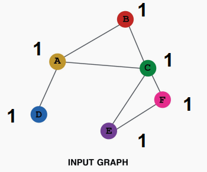

2. **给图中的节点增加唯一ID标识**（即用one-hot向量来表示特征）

   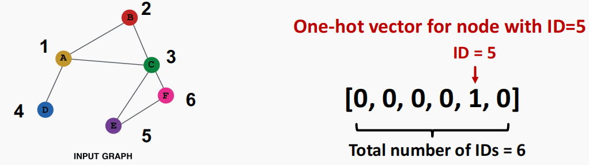

3. 两种方法的比较：
   |          |                    constant node feature                    |                     one-hot node feature                     |
   | :------: | :---------------------------------------------------------: | :----------------------------------------------------------: |
   |   图示   |   |  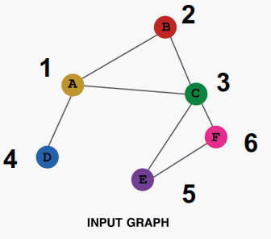  |
   | 表达能力 | **中等**：所有节点都一样，但是**GNN仍然可以学到图结构信息** |      **高**：每个节点ID唯一，所以可以储存节点特有的信息      |
   | 推理能力 |         **高**：对新节点可以赋于常数，再传入GNN即可         | **低**：无法泛化到新节点上，因为需要新增ID，无法用原先的one-hot向量来表示 |
   |  复杂度  |                    **低**：只有一维特征                     |         **高**：$O(\|V\|)$维特征，无法应用到大型图上         |
   | 适用情况 |                  所有图，inductive(归纳式)                  |                  小图，transductive(直推式)                  |

> **Inductive(归纳式) VS Transductive(直推式)**
>
> 机器学习训练通常涉及训练集（有标注）与测试集（无标注），具体分为两种模式：
>
> - 如果训练过程不需要测试集则是inductive
> - 如果训练过程需要测试集（无标注）则是transductive
>
> 注：测试集（无标注）不代表测试集真的没有label，仅表示在训练阶段可能会用到测试集但不包括label信息。
>
> 具体可以参考：👍[图解inductive+transductive ML](https://zhuanlan.zhihu.com/p/455808338)

#### 5.1.2.2 特征很难编码下的图特征增强

在有些情况下，如果不用特征专门加以区分，GNN很难只凭邻接矩阵学习到特定的图结构。比如：节点所处环上节点数（cycle count）这一属性。

在下图可以看到，两张图所有节点的度都相同，即degree=2。因此无论环上有多少个节点，GNN都会得到相同的计算图（二叉树），从而GNN只凭邻接矩阵无法完全分别两张图的特征。

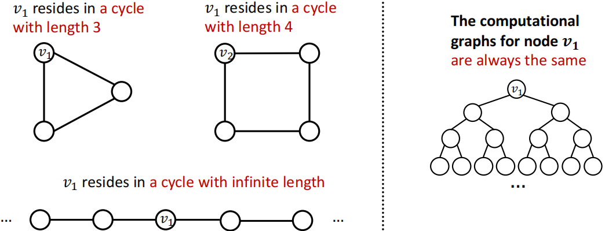

因此解决方法为引入cycle count这一节点特征进行图特征增强。我们可以通过one-hot向量对每一个节点的cycle count进行编码，节点数对应索引的元素为1，其他元素为0。可以得到，$v_1=[0,0,0,1,0]$ $v_2=[0,0,0,0,1]$，表示节点 $v_1$ 位于长度为3的环内，节点 $v_2$ 位于长度为4的环内。

> **其他常用于图数据增强的节点特征：**
>
> - 节点度 Node Degree
> - 节点中心 Node Centrality
> - 聚类系数 Clustering Coefficient
> - 图元 Graphlets
> - PageRank
> - ……

### 5.1.3 图结构增强（Structure Augmentation）

#### 5.1.3.1 稀疏图下的图结构增强

对稀疏图而言，可以通过增加虚拟边virtual nodes或虚拟节点virtual edges的方式加快图中的信息传递。

1.增加虚拟边

常用方法：通过虚拟边连接2-hop邻居节点

这种方法等价于在GNN计算时不用邻接矩阵 $A$ ，而是使用 $A+A^2$ （ $A^2$ 的每个元素是对应节点对之间长度为2的路径数量）

适用范例：二部图 bipartite graphs

如作者-论文组成的二部图，增加虚拟边可以在**合作作者**或者**同作者论文**之间增加链接关系。这样GNN可以浅一些，训练也会更快一些（因为在同类节点之间可以直接交互了）
但如果添的边太多了也会增加复杂性。

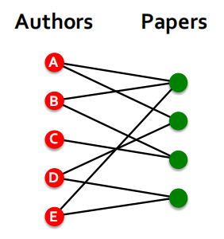

2.增加虚拟节点

常用方法：增加一个虚拟节点，这个虚拟节点与图（或者一个从图中选出的子图）上的所有节点相连

- 假设在稀疏图中，两个节点 Node A 和 Node B 的最短距离为10
- 在增加了虚拟节点后，所有的节点之间的最短距离均为2（Node A-Virtual node-Node B）

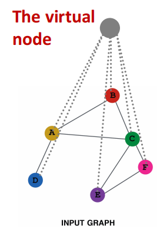

优势：极大促进了在稀疏图中信息传递的效用。

#### 5.1.3.2 稠密图下的图结构增强

常用方法：节点邻居抽样 node neighborhood sampling

在先前的内容中，message passing的过程需要使用一个节点的全部邻居节点。

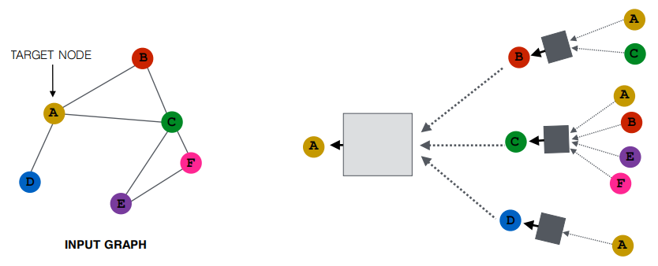

而节点邻居抽样是指在message passing的过程中，随机采样一部分邻居节点。

举例来说，对每一层，在传播信息时随机选2个邻居，计算图就会从上图变成下图：

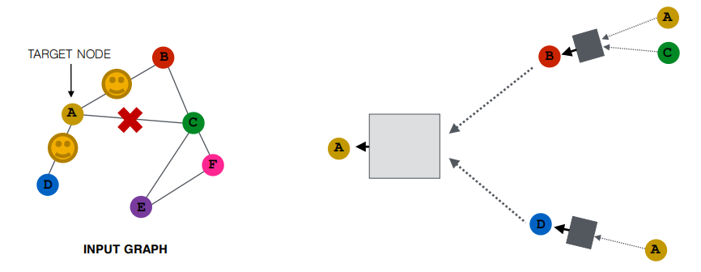

- 只有邻居节点 B、D 将信息传递给 A 。

在下一层，当我们计算节点嵌入的时候，我们可以采样不同的邻居节点，以增加模型鲁棒性。

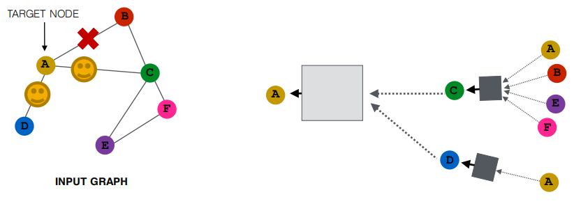

我们希望经抽样后，结果跟应用所有邻居节点的结果类似，但还能高效减少计算代价（在后续教程中会专门介绍如何将GNN方法泛化到大型数据上scale up）。

优点：计算图变小，训练速度更快。
缺点：可能会损失部分重要信息。
解决方案：对邻居节点的重要性进行排序，采样较为重要的节点而忽略那些不太重要的节点。

## 5.2 图神经网络学习目标

### 5.2.1 GNN Training Pipline

GNN训练流程图：输入图结构数据 → 用GNN训练数据 → 得到节点嵌入 → Prediction Head（在不同粒度的任务下，将节点嵌入转换为最终需要的预测向量）→ 得到预测向量和标签 → 选取损失函数 → 选取评估指标

### 5.2.2 Prediction Head

不同粒度下的任务需要不同的Prediction Head，以下为不同粒度下的Prediction Head：

- 节点级别
- 边级别
- 图级别

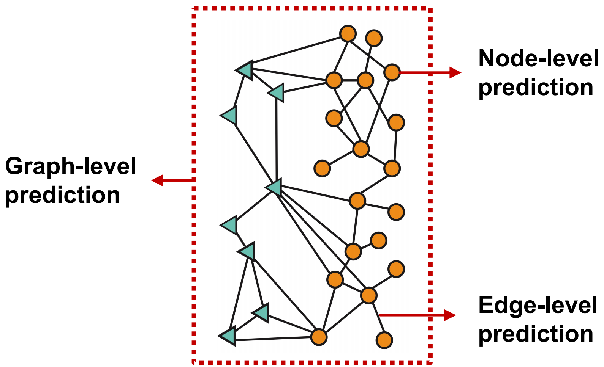

#### 5.2.2.1 节点级别：直接用节点嵌入做预测

通过 $L$ 层GNN网络，我们可以得到 $d$ 纬的节点嵌入向量，$\left\{\mathbf{h}_{v}^{(L)} \in \mathbb{R}^{d}, \forall v \in G\right\}$

预测目标向量： $k$ 维（k-way prediction）

- 分类任务：在 $k$ 个类别之间做分类
- 回归任务：在 $k$ 个目标 target / characteristic 上做回归

$\widehat{\mathbf{y}}_{\boldsymbol{v}}=\operatorname{Head}_{\text {node}}\left(\mathbf{h}_{v}^{(L)}\right)=\mathbf{W}^{(H)} \mathbf{h}_{v}^{(L)}$

- $\mathbf{W}^{(H)} \in \mathbb{R}^{k * d}$ : 我们将节点嵌入向量从 $d$ 维 $\mathbf{h}_{v}^{(L)} \in \mathbb{R}^{d}$ 映射到 $k$ 维 $\widehat{y}_{v} \in \mathbb{R}^{k}$ ，这样一来，我们可以比较预测标签和真实标签的差异，从而计算损失。

#### 5.2.2.2 边级别：用节点嵌入对来做预测

预测目标向量： $k$ 维（k-way prediction）

$\widehat{\mathbf{y}}_{\boldsymbol{u v}}=\operatorname{Head}_{\mathrm{edge}}\left(\mathbf{h}_{u}^{(L)}, \mathbf{h}_{v}^{(L)}\right)$

$\operatorname{Head}_{\mathrm{edge}}\left(\mathbf{h}_{u}^{(L)}, \mathbf{h}_{v}^{(L)}\right)$的可选方法有以下两种：

- Concatenation+Linear
- Dot product

1. Concatenation+Linear
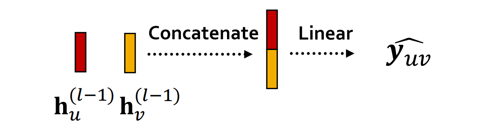

这种方法在讲 GAT 的时候介绍过，注意力机制 $a$ 可以用这种方法将节点对信息转换为注意力系数 $e$ 。

$\widehat{\mathbf{y}}_{\boldsymbol{u v}}=\operatorname{Linear}\left(\operatorname{Concat}\left(\mathbf{h}_{u}^{(L)}, \mathbf{h}_{v}^{(L)}\right)\right)$

- Linear(⋅) 将 $2d$ 维嵌入向量映射到 $k$ 维输出

2. Dot product

$\widehat{\mathbf{y}}_{\boldsymbol{u} v}=\left(\mathbf{h}_{u}^{(L)}\right)^{T} \mathbf{h}_{v}^{(L)}$

这种方法只能应用于1-way prediction（因为点积输出结果就为标量），例如链接预测任务（预测边是否存在）

如果需要应用到k-way prediction上，和 GAT 中的多头注意力机制类似，多算几组然后合并（公式中的$\mathbf{W}^{(1)}, \ldots, \mathbf{W}^{(k)}$是可学习的参数）：
$$
\begin{aligned}
&\hat{\mathbf{y}}_{u v}^{(1)}=\left(\mathbf{h}_{u}^{(L)}\right)^{T} \mathbf{W}^{(1)} \mathbf{h}_{v}^{(L)}\\
&\ldots \\
&\hat{\mathbf{y}}_{u v}^{(k)}=\left(\mathbf{h}_{u}^{(L)}\right)^{T} \mathbf{W}^{(k)} \mathbf{h}_{v}^{(L)}\\
&\hat{\mathbf{y}}_{u v}=\operatorname{Concat}\left(\hat{\mathbf{y}}_{u v}^{(1)}, \ldots, \hat{\mathbf{y}}_{u v}^{(k)}\right) \in \mathbb{R}^{k}
\end{aligned}
$$

#### 5.2.2.3 图级别：用图中所有节点的嵌入向量来做预测

预测目标向量： $k$ 维（k-way prediction）

$\hat{\mathbf{y}}_{G}=\operatorname{Head}_{\text {graph }}\left(\left\{\mathbf{h}_{v}^{(L)} \in \mathbb{R}^{d}, \forall v \in G\right\}\right)$

$\operatorname{Head}_{\text {graph }}(\cdot)$与GNN单层中的$\operatorname{AGG}(\cdot)$类似，都是将若干嵌入聚合为一个嵌入。

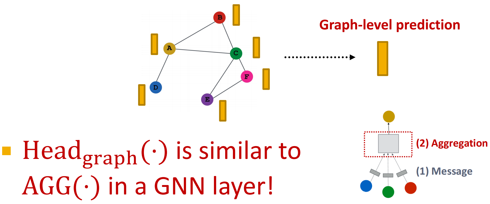

$\operatorname{Head}_{\text {graph }}\left(\left\{\mathbf{h}_{v}^{(L)} \in \mathbb{R}^{d}, \forall v \in G\right\})\right.$ 的可选方法有:
1. global mean pooling: $\hat{\mathbf{y}}_{G}=\operatorname{Mean}\left(\left\{\mathbf{h}_{v}^{(L)} \in \mathbb{R}^{d}, \forall v \in G\right\}\right)$
2. global max pooling: $\hat{\mathbf{y}}_{G}=\operatorname{Max}\left(\left\{\mathbf{h}_{v}^{(L)} \in \mathbb{R}^{d}, \forall v \in G\right\}\right)$
3. global sum pooling: $\hat{\mathbf{y}}_{G}=\operatorname{Sum}\left(\left\{\mathbf{h}_{v}^{(L)} \in \mathbb{R}^{d}, \forall v \in G\right\}\right)$

如果想比较不同大小的图，mean方法可能比较好（因为结果不受节点数量的影响）；
如果关心图的大小等信息，sum方法可能比较好；

> 这些方法都在小图上表现很好。但是在大图上采用全局池化方法可能会面临丢失信息的问题。
>
> **举例：我们以一维节点嵌入向量为例**
>
> 图 $G_1$ 的节点嵌入为{-1,-2,0,1,2}，图 $G_2$ 的节点嵌入为{-10,-20,0,10,20}，显然两个图的节点嵌入差别很大，图结构很不相同。
>
> 但是如果我们选取global sum pooling方法：
>
> $\hat{\mathbf{y}}_{G_{1}}=\operatorname{Sum}(\{-1,-2,0,1,2\})=0$
> $\hat{\mathbf{y}}_{G_{2}}=\operatorname{Sum}(\{-10,-20,0,10,20\})=0$
>
> 因此，这两个图的表示向量均为0，无法做出区分。
>
> **解决方案：层级化的池化 hierarchical global pooling** 
>
> 例如：采用$\operatorname{ReLU}(\operatorname{Sum}(\cdot))$做聚合，先分别聚合前两个节点和后三个节点的嵌入，然后再聚合这两个嵌入。
>
> $G_1$ 的节点嵌入：{-1,-2,0,1,2}
>
> - Round 1: $\hat{\mathbf{y}_{a}}=\operatorname{ReLU}(\operatorname{Sum}(\{-1,-2\}))=0, \hat{\mathbf{y}}_{b}=\operatorname{ReLU}(\operatorname{Sum}(\{0,1,2\}))=3$
> - Round 2: $\hat{\mathbf{y}_{G}}=\operatorname{ReLU}\left(\operatorname{Sum}\left(\left\{\mathbf{y}_{a}, \mathbf{y}_{b}\right\}\right)\right)=3$
>
> $G_2$ 的节点嵌入：{-10,-20,0,10,20}
>
> - Round 1: $\hat{\mathbf{y}_{a}}=\operatorname{ReLU}(\operatorname{Sum}(\{-10,-20\}))=0, \hat{\mathbf{y}}_{b}=\operatorname{ReLU}(\operatorname{Sum}(\{0,10,20\}))=30$
> - Round 2: $\hat{\mathbf{y}_{G}}=\operatorname{ReLU}\left(\operatorname{Sum}\left(\left\{\mathbf{y}_{a}, \mathbf{y}_{b}\right\}\right)\right)=30$
>
> 这样一来我们就可以区分 $G_1$ 和 $G_2$ 的表示向量了。
>

层级化的池化(Hierarchically pool)，也就是使用激活函数+聚合函数作为head，将节点划分成若干组进行池化之后再将所得结果进行池化。

如何在节点进行聚类划分的同时，对图的节点嵌入向量应用层级化的池化，正式DiffPool这篇工作所讨论的问题，以下为具体的流程示意图：

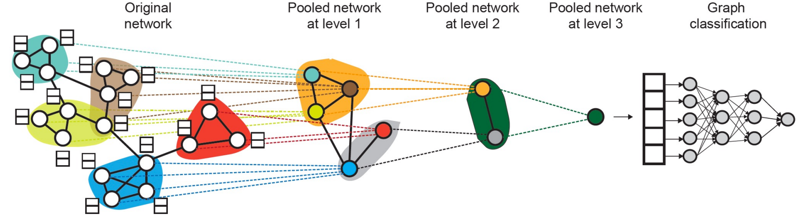

> 注：DiffPool在每个组聚类后创建了一个新的节点，并保留组与组之间的联系，进行新节点之间的边。